# Arch PowerShell

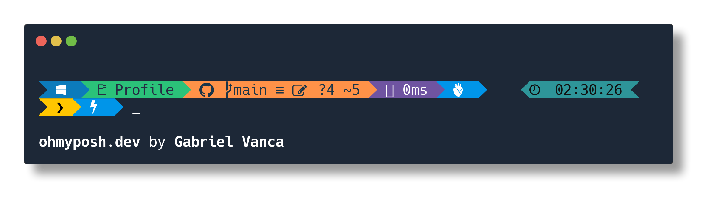

# Install Instructions

## 1. Install PowerShell Core

### Windows

Open a classic PowerShell terminal with administrator privileges and run the following:

```powershell
Set-ExecutionPolicy -ExecutionPolicy RemoteSigned
irm https://raw.githubusercontent.com/gabriel-vanca/Arch-PowerShell/main/Install/Core/Windows_Install_Core.ps1 | iex
```

Notes:
* For workstations, Windows 11 or higher is required. For servers, Windows Server 2022 or later is required.
* Windows PowerShell 5.1 is required for installing PowerShell 7, but not for updating an existing PowerShell 7 installation.
* Administrator privileges are required, as PowerShell 7 is installed and updated machine-wide via the MSI package.
* MSIX installs are not supported. This might mean this script will not install/update PowerShell 7.7 or higher, as the superior MSI support is scheduled to be deprecated in exchange for the much-less-capable MSIX install (pending an almost inevitable U-turn from Microsoft).
* The script looks through all the PowerShell 7 packages on WinGet and installs whatever is the latest one that supports MSI installs (currently 7.6.x).
* This will attempt to use WinGet, which comes included in Windows 11 and Windows Server 2025, in order to install/update PowerShell Core.
* If WinGet is not present (for example on Windows Server 2022), the script will try to use Chocolatey instead to install PowerShell Core.
* If you'd prefer to use WinGet but do not have it installed, you can use my other script to install it: https://github.com/gabriel-vanca/WinGet

### Ubuntu

Open a terminal and run the following. Do not use sudo: the script prompts for your password when it needs it.

```bash
wget -O - https://raw.githubusercontent.com/gabriel-vanca/Arch-PowerShell/main/Install/Core/Ubuntu_Install_Core.sh | bash
```

Note: Version 18.04 or above is required.

### MacOS

Open a terminal and run the following. Do not use sudo: the script prompts for your password when it needs it.

```bash
curl -fsSL https://raw.githubusercontent.com/gabriel-vanca/Arch-PowerShell/main/Install/Core/MacOS_Install_Core.sh | bash
```

Note:

* The script requires Homebrew to be already installed.
* MacOS Big Sur 11.5 or later is required.

## 2. Install Additional PowerShell Components

Open an elevated PowerShell 7 (`pwsh`) terminal and run the following commands in order to install the necessary PowerShell modules, Oh-my-Posh and the necessary fonts. Note that step 1 leaves you in classic Windows PowerShell: start a new `pwsh` window for this step, as these scripts require PowerShell 7.

```powershell
Invoke-RestMethod https://raw.githubusercontent.com/gabriel-vanca/Arch-PowerShell/main/PowerShell/Install/Additional_Components/Install_Additional_Components.ps1 | Invoke-Expression
```

## 3. Configure PowerShell Profile

Open a PowerShell terminal and run the following commands.

Notes:

* On Windows you need to run this from a terminal with admin privileges.
* On Linux, make sure the command is **not** run from the root user as in that case the theme will only be available for the root user.

```powershell

# Install Necessary Fonts
oh-my-posh font install FiraCode


# Install Oh-my-Posh Theme

```

# Included Tech Fonts

The following fonts that were designed for coding and terminal usage will be installed automatically.

## MonaLisa

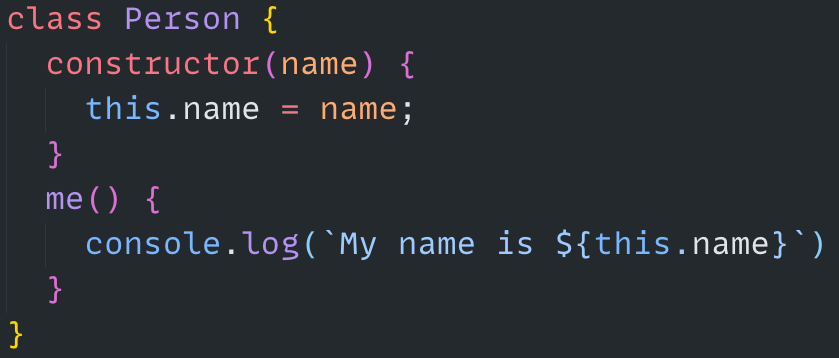

[MonoLisa](https://www.monolisa.dev/)

## JetBrains NF

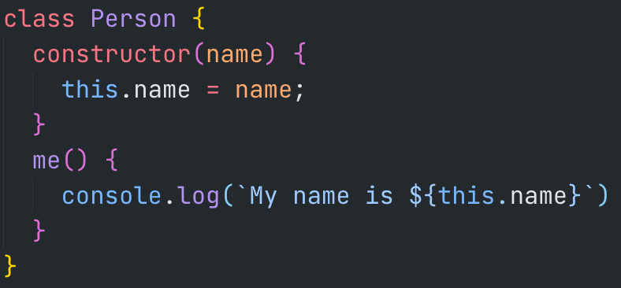

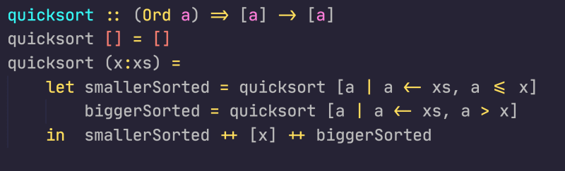

## Adobe Source Code Pro

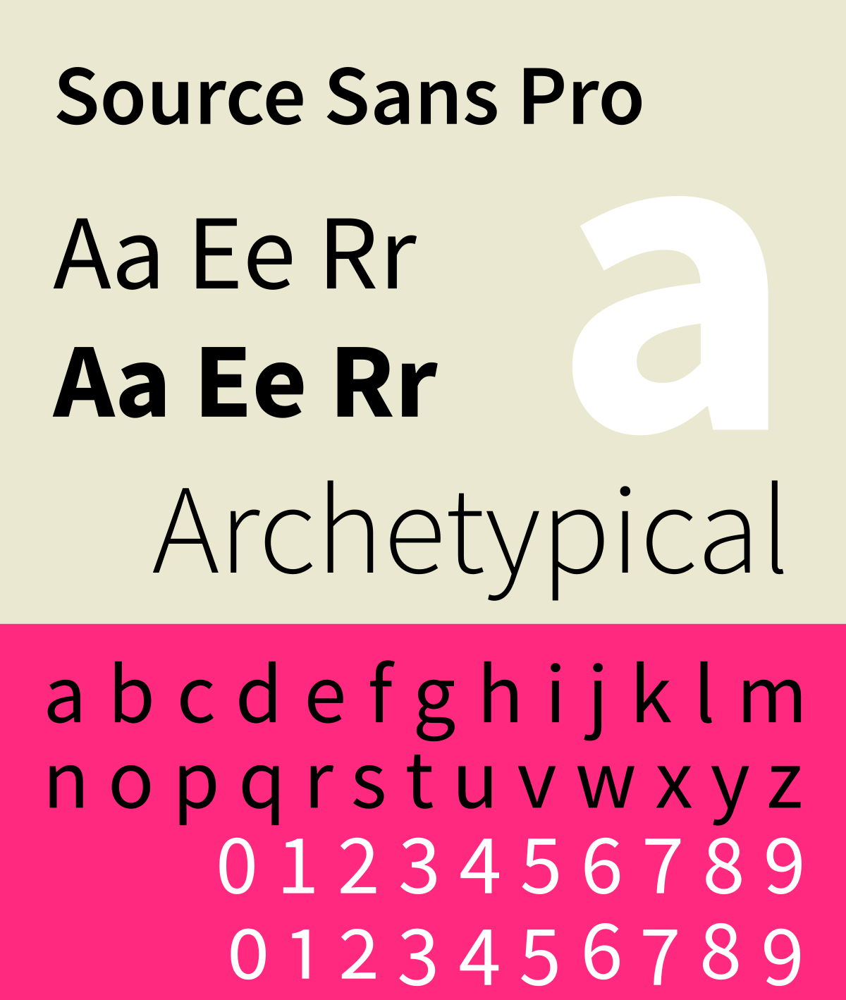

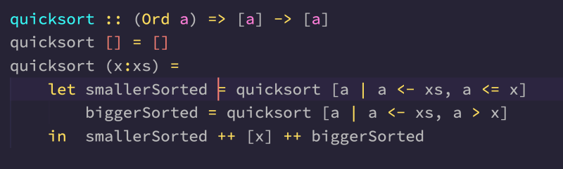

[Source Code Pro - Adobe Fonts](https://fonts.adobe.com/fonts/source-code-pro)

[Source Code Pro - Adobe GitHub](https://github.com/adobe-fonts/source-code-pro/releases)

## Cousine

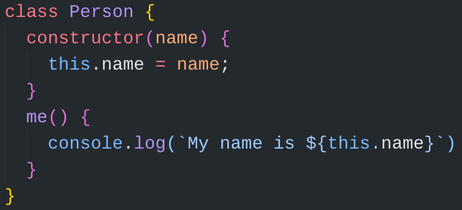

[Cousine - Google Fonts](https://fonts.google.com/specimen/Cousine)

## Roboto

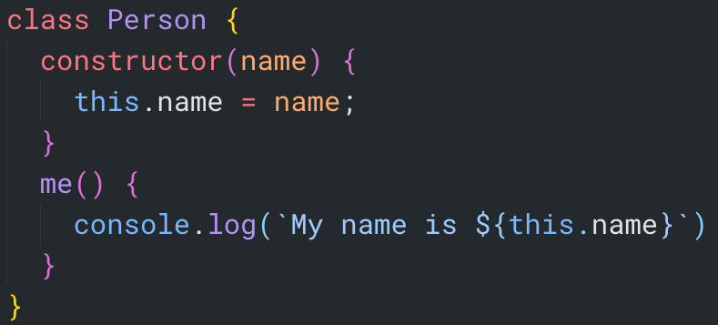

## Hasklug NF

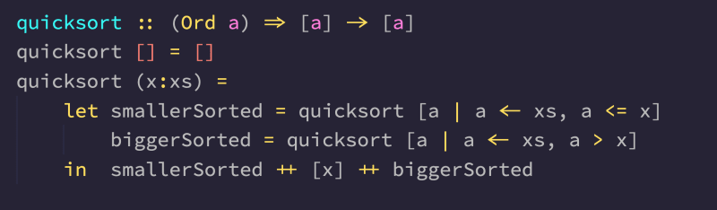

## FiraCode NF

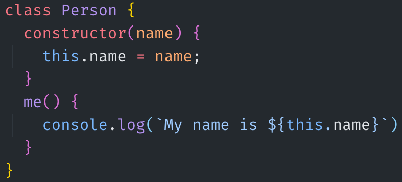

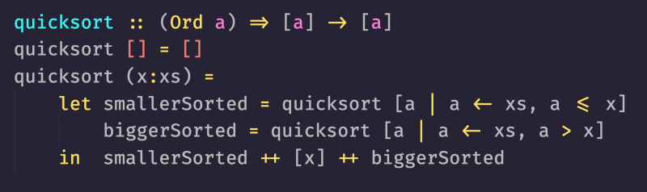

## Cascadia Code NF

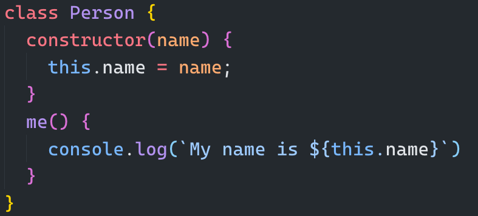

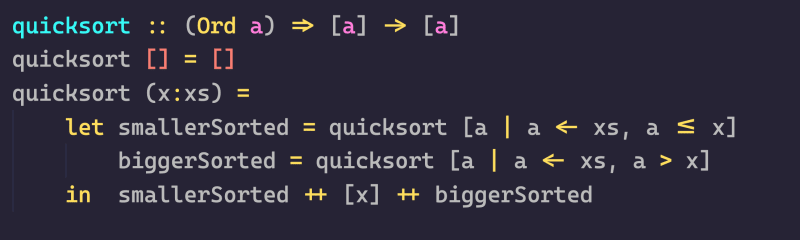

## Monoid

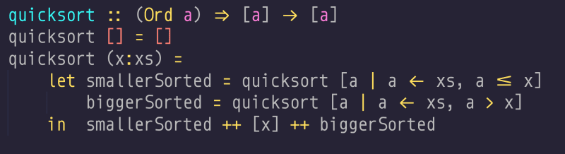

## Go Mono NF
